<div id="top"></div>

<!-- PROJECT INTRO -->

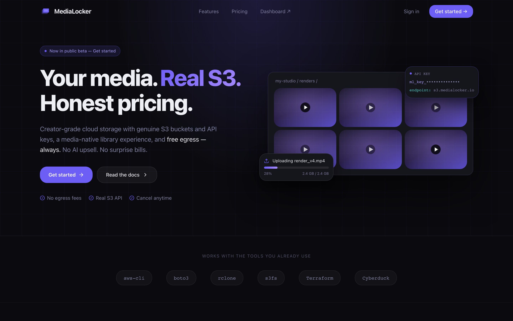

<div align="center">

# 📦 MediaLocker

  <a href="#-quick-start">Quick start</a>
  <span>&nbsp;&nbsp;•&nbsp;&nbsp;</span>
  <a href="https://docs.medialocker.io">Docs</a>
  <span>&nbsp;&nbsp;•&nbsp;&nbsp;</span>
  <a href="https://docs.medialocker.io/developer/api-reference">API reference</a>
  <span>&nbsp;&nbsp;•&nbsp;&nbsp;</span>
  <a href="https://docs.medialocker.io/self-hosting/">Self-hosting</a>
  <span>&nbsp;&nbsp;•&nbsp;&nbsp;</span>
  <a href="https://medialocker.io">Website</a>
  <br />

[](https://github.com/medialocker/medialocker-app/actions/workflows/ci.yml)
[](./LICENSE)
[](./.nvmrc)
[](https://pnpm.io)

  <hr />
</div>

**MediaLocker is cloud object storage built for media creators** — self-hostable, with a genuine S3-compatible API and a media-native library on top. Object bytes never transit the app; they move directly between the client and storage over short-lived **presigned URLs**, while MediaLocker handles organization, metadata, derivatives, quotas, and billing.

- 🪣 **Genuine S3 buckets & API** — SigV4-signed, works with `aws-cli`, `boto3`, `rclone`, `s3fs`, Terraform, and Cyberduck
- ⚡ **Presigned, never proxied** — uploads and downloads go straight from the client to storage via signed, time-limited URLs
- 🖼️ **Media-native library** — browse, preview, tag, and categorize images, video, audio, and PDFs
- 🎬 **Sets & storyboards** — variant collections and ordered clip sequences
- 🛠️ **Automatic derivatives** — a background worker probes uploads and generates image/video variants (`sharp` + `ffmpeg`)
- 🔍 **Full-text search** across your media
- 🤖 **MCP server** — AI agents manage your media through natural language
- 🔐 **Scoped API keys** — per-scope and per-bucket access for programmatic use
- 📊 **Usage, quotas & billing** — per-organization capacity with Stripe-backed, mid-cycle proration
- 💸 **Free egress, honest pricing** — bandwidth is metered for transparency, never billed
- 🛡️ **Multi-tenant by design** — Postgres row-level security; tenants never hold long-lived storage keys
- 🐳 **Self-host** with Docker Compose + Caddy (wildcard TLS), on Supabase Cloud (Postgres + Auth) and Hetzner Object Storage

<p align="right">(<a href="#top">back to top</a>)</p>

## 📸 Screenshots

A look at the dashboard and the marketing site 😍

<table>
  <tr>
    <td colspan="2">
      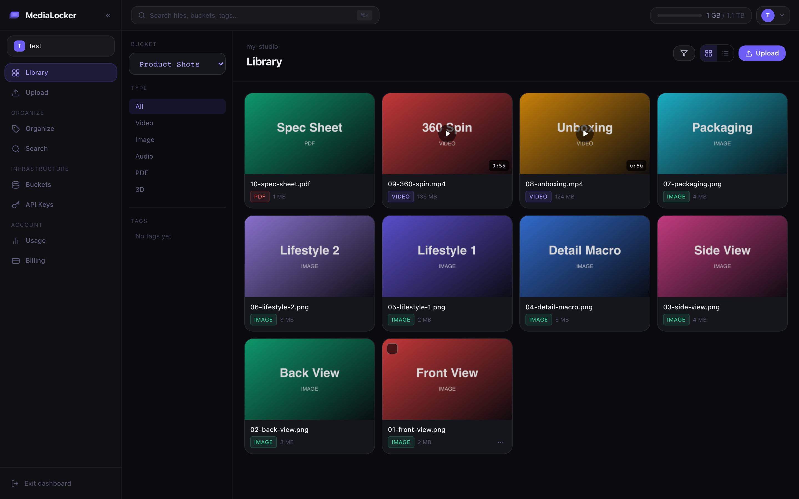
      <br />
      <p align="center">Media library — browse, filter, and preview every asset</p>
    </td>
  </tr>
  <tr>
    <td>
      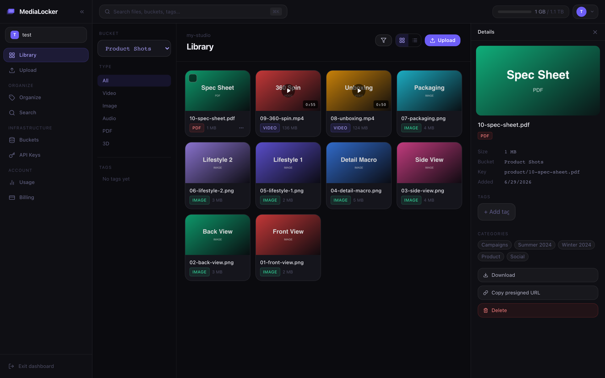
      <br />
      <p align="center">Asset detail — preview, metadata, tags &amp; categories</p>
    </td>
    <td>
      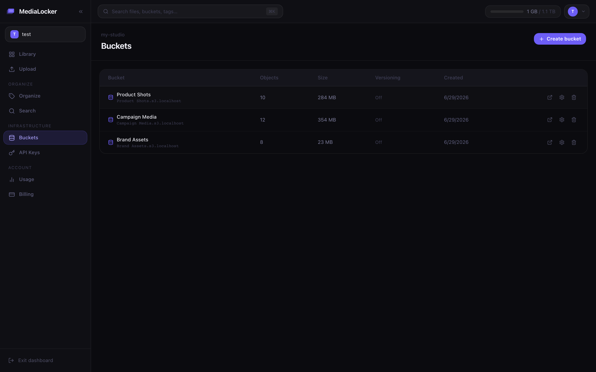
      <br />
      <p align="center">Buckets — per-bucket storage and object counts</p>
    </td>
  </tr>
  <tr>
    <td>
      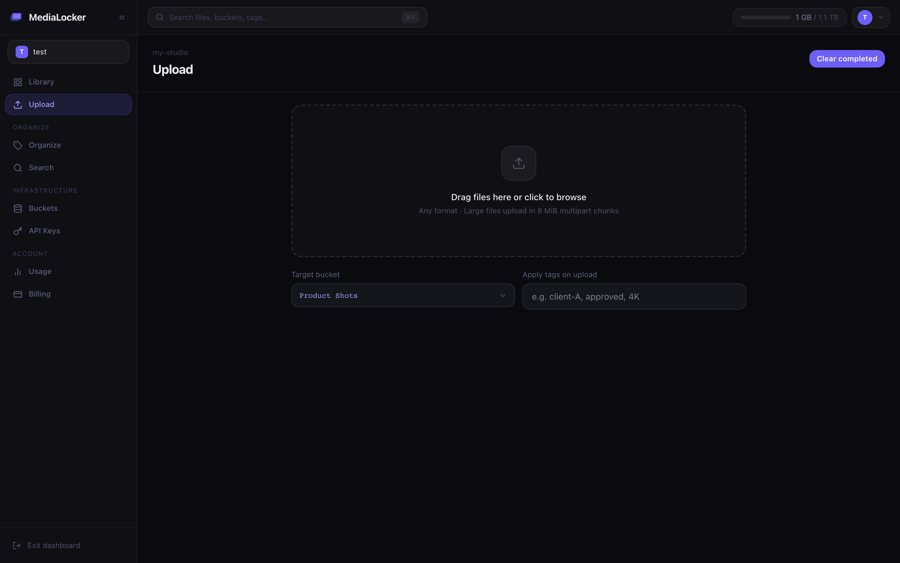
      <br />
      <p align="center">Upload — drag-and-drop straight to storage via presigned URLs</p>
    </td>
    <td>
      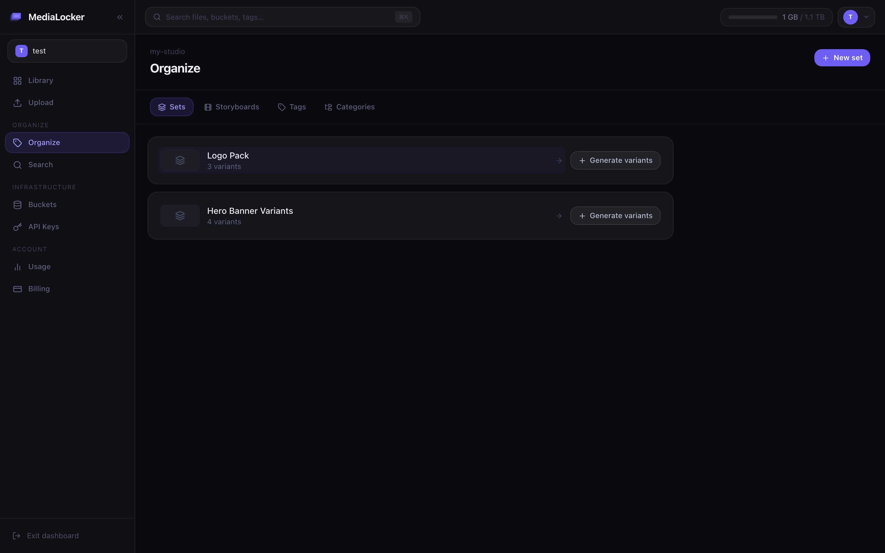
      <br />
      <p align="center">Organize — sets (variant collections) &amp; storyboards</p>
    </td>
  </tr>
  <tr>
    <td>
      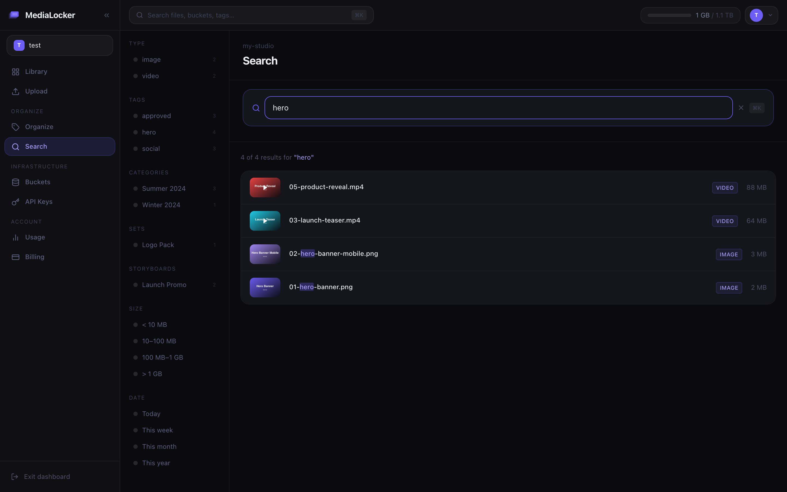
      <br />
      <p align="center">Search — full-text search across your media</p>
    </td>
    <td>
      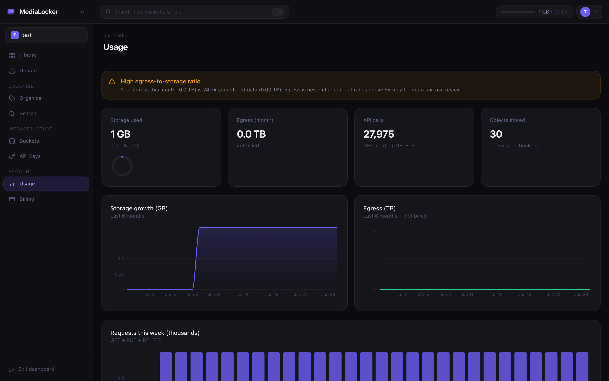
      <br />
      <p align="center">Usage — storage, egress, and API usage</p>
    </td>
  </tr>
  <tr>
    <td>
      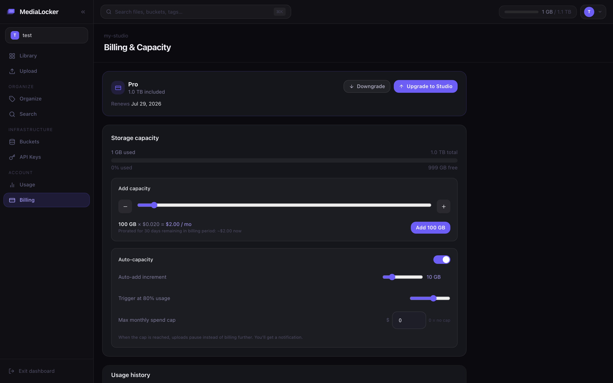
      <br />
      <p align="center">Billing — plan, capacity, and Stripe-backed upgrades</p>
    </td>
    <td>
      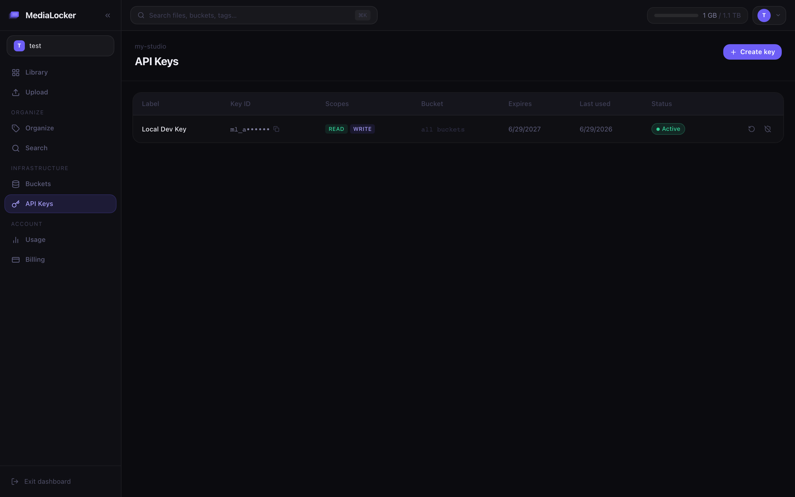
      <br />
      <p align="center">API keys — scoped keys for the REST API &amp; MCP</p>
    </td>
  </tr>
  <tr>
    <td>
      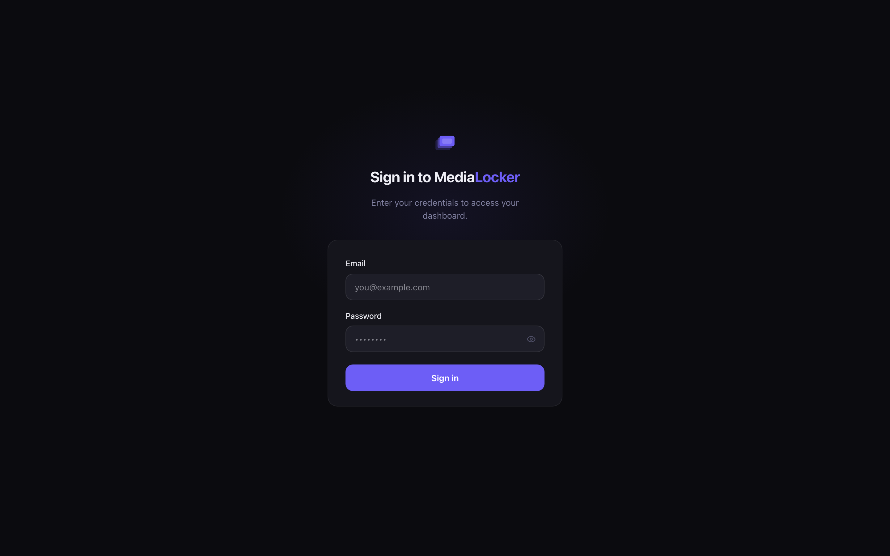
      <br />
      <p align="center">Sign in</p>
    </td>
    <td>
      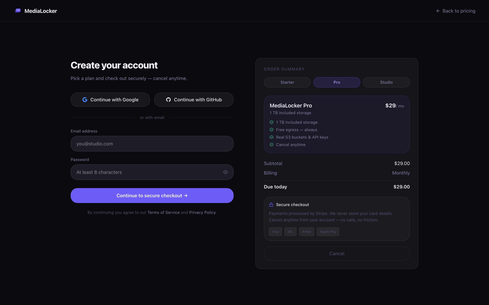
      <br />
      <p align="center">Sign up — pick a plan and create your account</p>
    </td>
  </tr>
</table>

<p align="right">(<a href="#top">back to top</a>)</p>

## 🤔 Why does MediaLocker exist?

Raw S3 + CloudFront is powerful but bare: no library, no previews, no derivatives, no quotas, and egress that quietly dominates the bill. Media-asset SaaS fixes the UX but locks your files behind a proprietary API, per-seat pricing, and someone else's infrastructure.

MediaLocker keeps the **genuine S3 API** (so `aws-cli`, `boto3`, `rclone`, and Terraform just work) and adds the media-native layer on top — a real library, automatic derivatives, sets/storyboards, usage quotas, Stripe billing, and a native **MCP server** for AI agents — all of it self-hostable on your own domain and infrastructure, with bytes that never transit the app.

<p align="right">(<a href="#top">back to top</a>)</p>

## 🧮 Comparison

How MediaLocker compares to rolling your own on raw S3, or to a typical media-asset SaaS (specifics vary by provider):

| | MediaLocker | Raw S3 + DIY | Media-asset SaaS |
|---|:---:|:---:|:---:|
| Open source & self-hostable | ✅ | ⚠️ infra only | ❌ |
| Run on your own domain & infra | ✅ | ✅ | ❌ |
| Genuine S3 API (SigV4, `aws-cli`/`boto3`/`rclone`) | ✅ | ✅ | ⚠️ varies |
| Media library (browse, preview, tag) | ✅ | ❌ | ✅ |
| Sets & storyboards | ✅ | ❌ | ⚠️ varies |
| Automatic image/video derivatives | ✅ | ⚠️ DIY (Lambda) | ✅ |
| Presigned direct transfer (bytes never proxied) | ✅ | ✅ | ⚠️ varies |
| Native MCP server for AI agents | ✅ | ❌ | ❌ |
| Per-org quotas + Stripe billing built in | ✅ | ❌ | ✅ |
| Free egress (bandwidth metered, never billed) | ✅ | ❌ | ⚠️ varies |
| No per-seat pricing | ✅ | ✅ | ❌ |

<p align="right">(<a href="#top">back to top</a>)</p>

## 😲 Built With

- ⚙️ **API / MCP / Worker** — TypeScript, [Fastify](https://fastify.dev), [BullMQ](https://docs.bullmq.io), `postgres`, the AWS SDK (S3 presigning + SigV4), [Zod](https://zod.dev), [Stripe](https://stripe.com)
- ⚛️ **Dashboard** — [Next.js](https://nextjs.org), React, [`@supabase/ssr`](https://supabase.com/docs), [TanStack Query](https://tanstack.com/query), Tailwind CSS, Recharts
- 🖼️ **Worker derivatives** — [sharp](https://sharp.pixelplumbing.com) (images), [fluent-ffmpeg](https://github.com/fluent-ffmpeg/node-fluent-ffmpeg) (video)
- 🗄️ **Data & Auth** — [Supabase Cloud](https://supabase.com) (managed Postgres + Auth), [Hetzner Object Storage](https://www.hetzner.com/storage/object-storage) (S3-compatible), [Redis](https://redis.io) (queues / rate limits)
- 🧭 **Edge** — [Caddy](https://caddyserver.com) (reverse proxy + automatic wildcard TLS)
- 📚 **Docs** — [VitePress](https://vitepress.dev)

### Repository layout

This is a [pnpm](https://pnpm.io) + [Turborepo](https://turbo.build) monorepo.

```
apps/
  api      REST API (Fastify) — auth, presign, media, billing, search
  app      Dashboard (Next.js) — buckets, upload, organize, usage, billing
  mcp      MCP server (Fastify gateway) — tools/resources for AI agents
  worker   Background processor (BullMQ) — derivatives, media probing
  docs     Documentation site (VitePress)

packages/
  auth           API keys, JWT verification (JWKS), internal HMAC signing
  billing        Stripe integration, capacity provisioning, proration
  config         Validated environment configuration (Zod)
  core           Capacity accounting, atomic quota reservation, tenancy, pricing
  db             Postgres schema, SQL migrations, seed scripts
  media          Derivative variants, media probing, search helpers
  observability  OpenTelemetry instrumentation
  ui             Shared React components (incl. the brand mark)

infra/
  docker-compose.yml   Self-hosted service stack
  caddy/               Reverse proxy + wildcard TLS (DNS-01)
```

<p align="right">(<a href="#top">back to top</a>)</p>

<!-- GETTING STARTED -->

# 🤯 Quick Start

> **Requirements:** Node.js **≥ 22** (`.nvmrc` pins `22`), [pnpm](https://pnpm.io) **9.15** (`corepack enable && corepack prepare pnpm@9.15.0 --activate`), and Docker. For a real deployment you'll also need a **Supabase Cloud** project (Postgres + Auth) and **Hetzner Object Storage** credentials — see the [Self-Hosting Guide](https://docs.medialocker.io/self-hosting/).

### Install

```bash
git clone https://github.com/medialocker/medialocker-app.git
cd medialocker-app
pnpm install
cp .env.example .env   # fill in Supabase, Hetzner/S3, Stripe, and secret values
```

### Run with Docker Compose (self-host)

```bash
DATABASE_URL=<session-or-direct-url> pnpm db:migrate
DATABASE_URL=<session-or-direct-url> pnpm stripe:setup
docker compose -f infra/docker-compose.yml up -d --build
```

Caddy terminates TLS and routes each hostname to the right service. Start with the [Self-Hosting Guide](https://docs.medialocker.io/self-hosting/) and the [Environment Variables reference](https://docs.medialocker.io/self-hosting/environment).

> **Database note:** migrations and `stripe:setup` hold a session-level advisory lock, so they must run against the **session pooler (port 5432) or a direct connection** — not the `6543` transaction pooler used at runtime.

### Develop from source

```bash
pnpm dev          # run all apps in watch mode (turbo)
pnpm build        # build every package and app
pnpm lint         # lint the workspace
pnpm typecheck    # type-check the workspace
pnpm test         # unit tests (per package, via vitest)
pnpm format       # prettier --write across the repo
```

> **Tip:** `pnpm seed:dev` creates a fully-populated test organization (login `test@test.com` / `Test123!`) with buckets, media, sets, storyboards, usage history, and an API key — ideal for local testing against MinIO.

### Integration tests

The integration suite exercises capacity accounting and billing math against **real Postgres** (the unit suites mock the DB). It runs outside `pnpm test`:

```bash
pnpm test:integration:setup      # bring up throwaway Postgres + Redis
pnpm test:integration            # run the suites
pnpm test:integration:teardown   # tear down
```

<p align="right">(<a href="#top">back to top</a>)</p>

# 📐 Architecture

MediaLocker runs as a **hybrid deployment** — your own services behind Caddy, with managed Postgres/Auth and S3-compatible object storage:

| Concern                                                      | Provider                                   |
| ------------------------------------------------------------ | ------------------------------------------ |
| Application services (`api`, `app`, `mcp`, `worker`, `docs`) | Self-hosted (Docker Compose)               |
| Reverse proxy + TLS                                          | Self-hosted (Caddy, DNS-01 wildcard)       |
| Queue / cache                                                | Self-hosted (Redis)                        |
| **Postgres + Auth**                                          | **Supabase Cloud** (managed)               |
| **Object storage**                                           | **Hetzner Object Storage** (S3-compatible) |
| Payments                                                     | Stripe                                     |

```
Browser / S3 client / AI agent
  │
  ▼
Caddy (:443, automatic wildcard TLS)
  ├── app.medialocker.io    ──►  app     (dashboard, Next.js)
  ├── api.medialocker.io    ──►  api     (REST control plane, Fastify)
  ├── mcp.medialocker.io    ──►  mcp     (MCP endpoint for AI agents)
  ├── docs.medialocker.io   ──►  docs    (VitePress static site)
  └── *.s3.medialocker.io   ──►  presigned URLs ──►  Hetzner Object Storage

api / worker ──► Supabase Cloud (Postgres + Auth)  +  Redis (queues, rate limits)
```

The backend holds the master storage credential and issues short-lived **presigned URLs**; tenants never receive long-lived storage keys, and object bytes never pass through the application. See the [Architecture guide](https://docs.medialocker.io/self-hosting/) for the full breakdown.

<p align="right">(<a href="#top">back to top</a>)</p>

<!-- CONTRIBUTING -->

# ⭐ Contributing

Contributions are what make the open-source community such an amazing place to learn, inspire, and create. Any contributions you make are **greatly appreciated**.

1. Fork the project
2. Create your feature branch (`git checkout -b feature/AmazingFeature`)
3. Commit your changes (`git commit -m 'Add some AmazingFeature'`)
4. Push to the branch (`git push origin feature/AmazingFeature`)
5. Open a pull request

Please read [`CONTRIBUTING.md`](./CONTRIBUTING.md) for the development workflow and coding standards, our [Code of Conduct](./CODE_OF_CONDUCT.md), and [`SECURITY.md`](./SECURITY.md) to report a vulnerability. Don't forget to give the project a star — thanks!

<p align="right">(<a href="#top">back to top</a>)</p>

<!-- LICENSE -->

# 🛡 License

Distributed under the **GNU Affero General Public License v3.0**. If you run a modified version as a network service, the AGPL requires you to make your modified source available to its users. See [`LICENSE`](./LICENSE) for the full text.

<p align="right">(<a href="#top">back to top</a>)</p>
